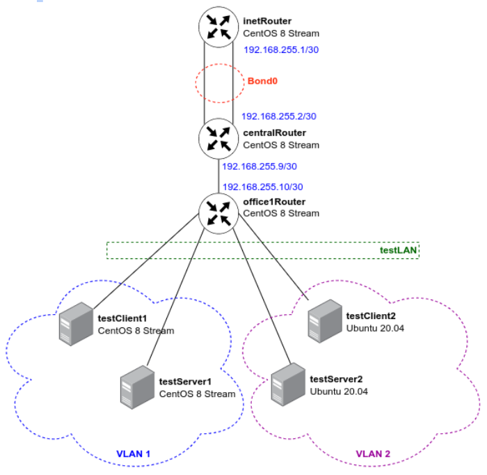
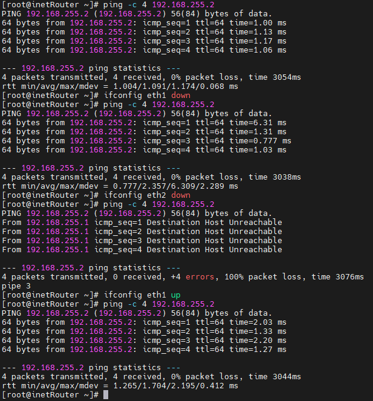

# Vagrant-стенд c VLAN и LACP
## Цель домашнего задания
### Научиться настраивать VLAN и LACP.
### Описание домашнего задания
в Office1 в тестовой подсети появляется сервера с доп интерфесами и адресами
в internal сети testLAN:
- testClient1 - 10.10.10.254
- testClient2 - 10.10.10.254
- testServer1- 10.10.10.1
- testServer2- 10.10.10.1
Равести вланами:
testClient1 <-> testServer1
testClient2 <-> testServer2
Между centralRouter и inetRouter "пробросить" 2 линка (общая inernal сеть) и
объединить их в бонд, проверить работу c отключением интерфейсов

### Схема сети:

## Проверка работы bond-интерфейса.
На inetRouter поочерёдно отключяаем интерфейсы eth1 и eth2 и проверяем, идёт ли трафик до centralRouter.
Делаем вывод, что трфик идёт, пока активен хотя бы один из двух интерфейсов, что и требовалось доказать. 

## Проверка:

